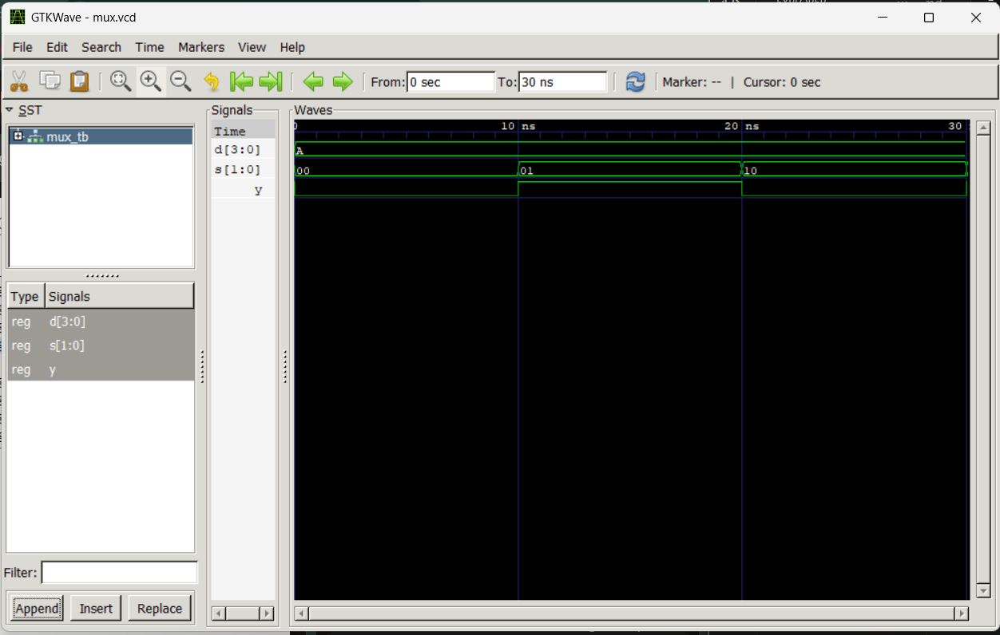
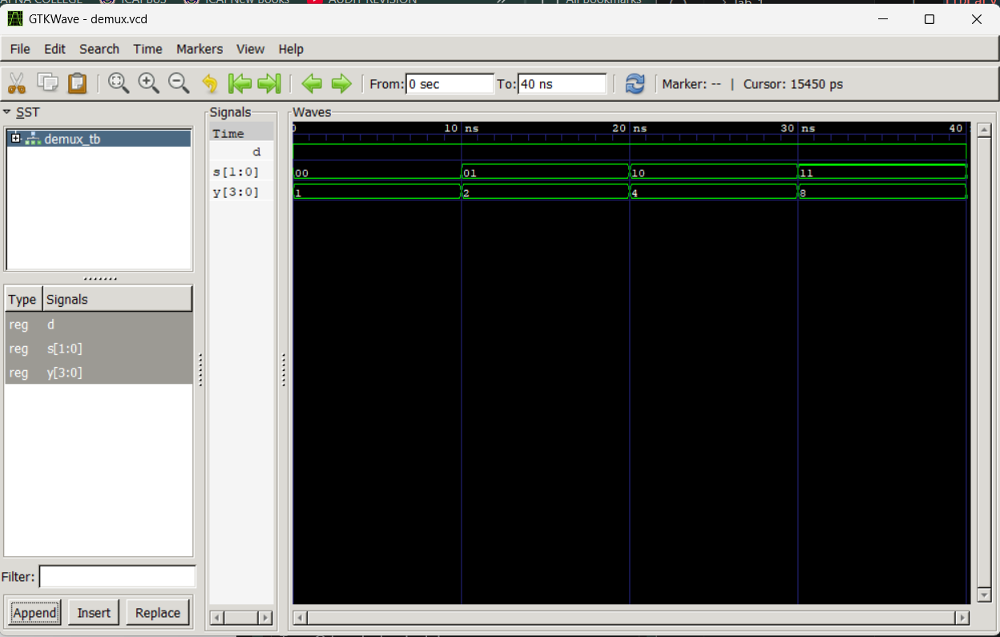

# Computer Architecture Lab 4  
## Multiplexers and Demultiplexers in VHDL
---

# Objective

- Understand the design and functionality of multiplexers and demultiplexers
- Implement 4-to-1 multiplexer and 1-to-4 demultiplexer in VHDL
- Write testbenches to simulate and verify the designs
- Analyze waveforms and validate the outputs using GTKWave
- Compare behavioral characteristics of combinational circuits

---

# Tools and Environment

| Tool | Purpose |
|---|---|
| VS Code | Code editor / IDE |
| GHDL | VHDL compiler and simulator |
| GTKWave | Waveform viewer |
| VHDL Extension (VHDLwhiz) | Syntax highlighting and snippets |

---

# Theory

## What are Multiplexers?

A multiplexer (MUX) is a combinational circuit that selects one of several input signals and forwards it to a single output line.

### Key Characteristics:
- **Inputs**: n select lines and 2^n data input lines
- **Outputs**: 1 output line
- **Function**: Routes one selected input to the output based on select signal
- **Applications**: Data routing, signal selection, function generators, analog signal switching

### 4-to-1 Multiplexer:
- **Inputs**: 4 data input lines (I0, I1, I2, I3) and 2 select lines (S0, S1)
- **Outputs**: 1 output line (Y)
- **Truth Table**:

| S1 | S0 | Y |
|----|----|---|
| 0  | 0  | I0 |
| 0  | 1  | I1 |
| 1  | 0  | I2 |
| 1  | 1  | I3 |



---

## What are Demultiplexers?

A demultiplexer (DEMUX) is a combinational circuit that receives data on a single input line and distributes it to one of 2^n output lines based on select signals.

### Key Characteristics:
- **Inputs**: 1 data input line and n select lines
- **Outputs**: 2^n output lines
- **Function**: Routes the input to one selected output based on select signal
- **Applications**: Data distribution, signal routing, output decoding, address selection

### 1-to-4 Demultiplexer:
- **Inputs**: 1 data input line (D) and 2 select lines (S1, S0)
- **Outputs**: 4 output lines (Y0, Y1, Y2, Y3)
- **Truth Table**:

| S1 | S0 | Y3 | Y2 | Y1 | Y0 |
|----|----|----|----|----|---|
| 0  | 0  | 0  | 0  | 0  | D |
| 0  | 1  | 0  | 0  | D  | 0 |
| 1  | 0  | 0  | D  | 0  | 0 |
| 1  | 1  | D  | 0  | 0  | 0 |

### 1-to-4 Demultiplexer Block Diagram:

```
        ┌─────────────────┐
        │                 │
    D ──┤                 │
        │   DEMUX 1-to-4  ├──── Y0
    S0 ─┤                 │
        │                 ├──── Y1
    S1 ─┤                 │
        │                 ├──── Y2
        │                 │
        └─────────────────┘
                           ├──── Y3
```



**Circuit Logic:**
- Y0 is active (receives D) when S1=0 and S0=0
- Y1 is active (receives D) when S1=0 and S0=1
- Y2 is active (receives D) when S1=1 and S0=0
- Y3 is active (receives D) when S1=1 and S0=1
- All other outputs remain LOW (0)

---

# VHDL Implementation Concepts

## Concurrent Assignments with Conditional Selection

Multiplexers and demultiplexers can be implemented using conditional assignment operators:

### Multiplexer Example:
```vhdl
Y <= I0 when S = "00" else
     I1 when S = "01" else
     I2 when S = "10" else
     I3 when S = "11" else
     '0';
```

### Demultiplexer Example:
```vhdl
Y(0) <= D when S = "00" else '0';
Y(1) <= D when S = "01" else '0';
Y(2) <= D when S = "10" else '0';
Y(3) <= D when S = "11" else '0';
```

These represent the combinational logic where the output selection is determined by the select lines in parallel.

---

# Test Cases

## Demultiplexer Test Cases (demux_tb.vhd)

| Time | D | S1 | S0 | Y3 | Y2 | Y1 | Y0 | Description |
|------|---|----|----|----|----|----|----|-------------|
| 0-10 ns | 1 | 0 | 0 | 0 | 0 | 0 | 1 | Input D=1 routed to Y0 |
| 10-20 ns | 1 | 0 | 1 | 0 | 0 | 1 | 0 | Input D=1 routed to Y1 |
| 20-30 ns | 1 | 1 | 0 | 0 | 1 | 0 | 0 | Input D=1 routed to Y2 |
| 30-40 ns | 1 | 1 | 1 | 1 | 0 | 0 | 0 | Input D=1 routed to Y3 |
| 40-50 ns | 0 | 1 | 0 | 0 | 0 | 0 | 0 | Input D=0 routed to Y2 |

---

# Simulation Results

The simulation results for the 4-to-1 multiplexer and 1-to-4 demultiplexer can be viewed in the `.vcd` files using GTKWave.

## Running Simulations

To compile and simulate the designs:

```bash
ghdl -a mux_4to1.vhd
ghdl -a mux_tb.vhd
ghdl -e mux_tb
ghdl -r mux_tb --vcd=mux.vcd

ghdl -a demux_1to4.vhd
ghdl -a demux_tb.vhd
ghdl -e demux_tb
ghdl -r demux_tb --vcd=demux.vcd
```

To view waveforms:

```bash
gtkwave mux.vcd
gtkwave demux.vcd
```

---

# Results

## 4-to-1 Multiplexer Results

The 4-to-1 multiplexer successfully routes the selected input to the output based on the 2-bit select signal:
- When S = "00", input I0 is forwarded to Y
- When S = "01", input I1 is forwarded to Y
- When S = "10", input I2 is forwarded to Y
- When S = "11", input I3 is forwarded to Y

The output propagates with minimal delay, confirming the combinational logic behavior.

## 1-to-4 Demultiplexer Results

The 1-to-4 demultiplexer successfully distributes the input signal to one of four outputs based on the 2-bit select signal:
- When S = "00", output Y0 receives input D, while Y1, Y2, Y3 remain LOW
- When S = "01", output Y1 receives input D, while Y0, Y2, Y3 remain LOW
- When S = "10", output Y2 receives input D, while Y0, Y1, Y3 remain LOW
- When S = "11", output Y3 receives input D, while Y0, Y1, Y2 remain LOW

The demultiplexer correctly routes the input signal to the selected output line.

---

# Conclusion

This lab successfully demonstrated the design and implementation of fundamental multiplexer and demultiplexer circuits in VHDL. Key learnings include:

1. **Multiplexers** act as data selectors, choosing one of multiple inputs based on control signals
2. **Demultiplexers** act as data distributors, routing a single input to one of multiple outputs
3. **Conditional assignment operators** in VHDL provide a clear and efficient way to implement these circuits
4. **Waveform simulation and analysis** using GTKWave validate the correctness of the designs
5. These circuits are fundamental building blocks in digital systems for data routing and selection

Both the 4-to-1 multiplexer and 1-to-4 demultiplexer behaved as expected, with outputs correctly responding to changes in the select lines. The use of concurrent assignments in VHDL ensures that all logic operations occur simultaneously, reflecting real hardware behavior.


