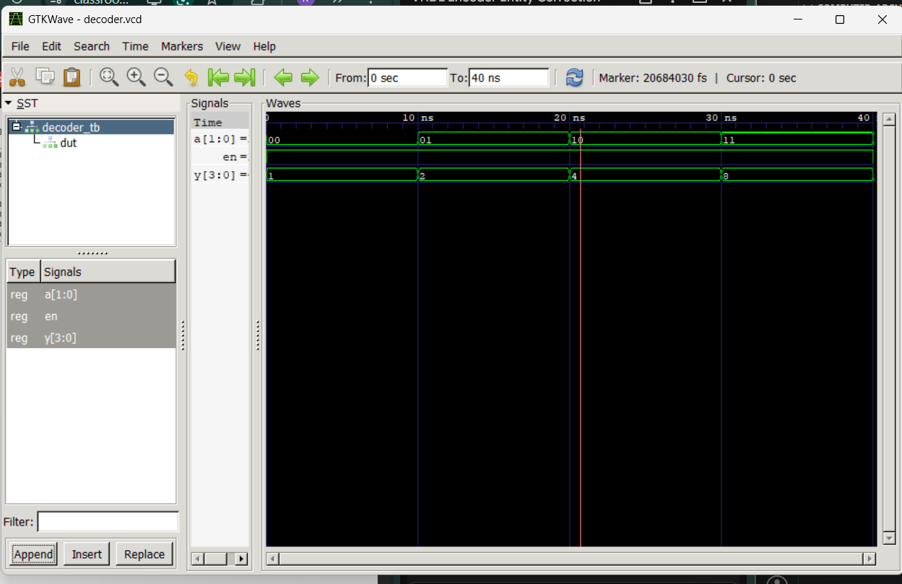
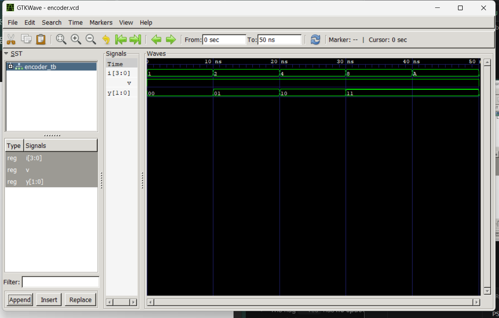

# Computer Architecture Lab 3  
## Decoders and Encoders in VHDL
---

# Objective

- Understand the design and functionality of decoders and encoders
- Implement 2-to-4 decoder and 4-to-2 encoder in VHDL
- Write testbenches to simulate and verify the designs
- Analyze waveforms and validate the outputs using GTKWave
- Compare behavioral characteristics of combinational circuits

---

# Tools and Environment

| Tool | Purpose |
|---|---|
| VS Code | Code editor / IDE |
| GHDL | VHDL compiler and simulator |
| GTKWave | Waveform viewer |
| VHDL Extension (VHDLwhiz) | Syntax highlighting and snippets |

---

# Theory

## What are Decoders?

A decoder is a combinational circuit that converts binary information from n input lines to a maximum of 2^n unique output lines. 

### Key Characteristics:
- **Inputs**: n input lines (binary code)
- **Outputs**: Up to 2^n output lines
- **Function**: Only one output line is asserted (usually HIGH) for a given input combination
- **Applications**: Address decoding, display drivers, multiplexer control

### 2-to-4 Decoder:
- **Inputs**: 2 input lines
- **Outputs**: 4 output lines
- **Truth Table**:

| A | B | Y3 | Y2 | Y1 | Y0 |
|---|---|----|----|----|----|
| 0 | 0 | 0  | 0  | 0  | 1  |
| 0 | 1 | 0  | 0  | 1  | 0  |
| 1 | 0 | 0  | 1  | 0  | 0  |
| 1 | 1 | 1  | 0  | 0  | 0  |

---

## What are Encoders?

An encoder is a combinational circuit that converts information from 2^n input lines to n output lines representing the binary equivalent of the active input.

### Key Characteristics:
- **Inputs**: Up to 2^n input lines
- **Outputs**: n output lines (binary code)
- **Function**: Only one input line is asserted at a time
- **Applications**: Priority encoding, keyboard encoding, address generation

### 4-to-2 Encoder:
- **Inputs**: 4 input lines (only one active at a time)
- **Outputs**: 2 output lines (binary)
- **Truth Table**:

| I3 | I2 | I1 | I0 | A | B |
|----|----|----|----|----|---|
| 0  | 0  | 0  | 1  | 0  | 0 |
| 0  | 0  | 1  | 0  | 0  | 1 |
| 0  | 1  | 0  | 0  | 1  | 0 |
| 1  | 0  | 0  | 0  | 1  | 1 |

---

# VHDL Implementation Concepts

## Concurrent Assignments

Concurrent assignment statements are executed simultaneously in hardware:

```vhdl
Y0 <= not A and not B;
Y1 <= not A and B;
Y2 <= A and not B;
Y3 <= A and B;
```

This represents the parallel nature of combinational logic where all outputs are computed at the same time.

---

# Simulation Results

## Decoder Output

The following image shows the simulation results for the 2-to-4 decoder:



This waveform demonstrates how the decoder outputs transition based on the input combinations. Only one output is HIGH for each input state.

---

## Encoder Output

The following image shows the simulation results for the 4-to-2 encoder:



This waveform shows how the encoder generates binary output codes based on which input line is active.

---

# Files in This Lab

| File | Description |
|---|---|
| `decoder_2to4.vhd` | 2-to-4 Decoder implementation |
| `decoder_tb.vhd` | Testbench for decoder |
| `encoder_4to2.vhd` | 4-to-2 Encoder implementation |
| `encoder_tb.vhd` | Testbench for encoder |
| `decoder.vcd` | Decoder simulation waveform |
| `encoder.vcd` | Encoder simulation waveform |
| `decoder_output.png` | Decoder simulation output image |
| `encoder_output.png` | Encoder simulation output image |

---

# Key Learnings

1. **Decoders and Encoders** are fundamental combinational circuits used in digital systems
2. **Concurrent logic** in VHDL mimics hardware behavior where multiple operations happen simultaneously
3. **Waveform analysis** is crucial for verifying correct behavior of digital circuits
4. **Testbenches** provide systematic way to validate designs before implementation

---
