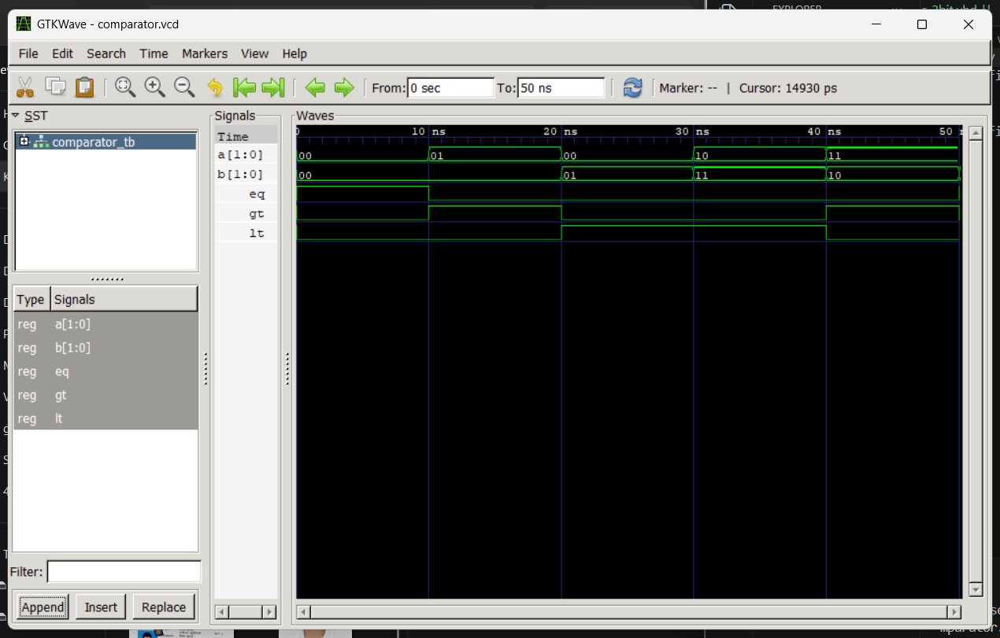

# Computer Architecture Lab 5  
## 2-Bit Comparator in VHDL
---

# Objective

- Understand the design and functionality of magnitude comparators
- Implement a 2-bit comparator in VHDL
- Write testbenches to simulate and verify the design
- Analyze waveforms and validate the outputs using GTKWave
- Compare binary numbers and output equality, greater than, and less than signals

---

# Tools and Environment

| Tool | Purpose |
|---|---|
| VS Code | Code editor / IDE |
| GHDL | VHDL compiler and simulator |
| GTKWave | Waveform viewer |
| VHDL Extension (VHDLwhiz) | Syntax highlighting and snippets |

---

# Theory

## What is a Magnitude Comparator?

A magnitude comparator is a combinational circuit that compares two binary numbers and produces output signals indicating the relationship between them (equal, greater than, or less than).

### Key Characteristics:
- **Inputs**: Two n-bit binary numbers (A and B)
- **Outputs**: Three output lines (EQ, GT, LT)
- **Function**: Compares magnitudes and indicates which number is larger
- **Applications**: Sorting circuits, voting systems, control systems, range checking

### 2-Bit Comparator:
- **Inputs**: Two 2-bit binary numbers (A and B)
- **Outputs**: 
  - EQ (Equal) - Active when A = B
  - GT (Greater Than) - Active when A > B
  - LT (Less Than) - Active when A < B

### Truth Table:

| A1 | A0 | B1 | B0 | A | B | EQ | GT | LT | Condition |
|----|----|----|----|----|---|----|----|----|----|
| 0  | 0  | 0  | 0  | 0  | 0  | 1  | 0  | 0  | A = B |
| 0  | 1  | 0  | 0  | 1  | 0  | 0  | 1  | 0  | A > B |
| 0  | 0  | 0  | 1  | 0  | 1  | 0  | 0  | 1  | A < B |
| 1  | 0  | 1  | 1  | 2  | 3  | 0  | 0  | 1  | A < B |
| 1  | 1  | 1  | 0  | 3  | 2  | 0  | 1  | 0  | A > B |
| 1  | 1  | 1  | 1  | 3  | 3  | 1  | 0  | 0  | A = B |

---

# VHDL Implementation Concepts

## Behavioral Modeling

The comparator is implemented using behavioral modeling with conditional logic:

```vhdl
process(A, B)
begin
    if unsigned(A) = unsigned(B) then
        EQ <= '1'; GT <= '0'; LT <= '0';
    elsif unsigned(A) > unsigned(B) then
        EQ <= '0'; GT <= '1'; LT <= '0';
    else
        EQ <= '0'; GT <= '0'; LT <= '1';
    end if;
end process;
```

This approach uses type conversion with `unsigned()` to compare binary vectors as numerical values.

---

# Simulation Steps

To compile, simulate, and view the waveforms, execute the following commands in your terminal:

```bash
# 1. Analyze the design files
ghdl -a comparator_2bit.vhd comparator_tb.vhd

# 2. Elaborate the testbench entity
ghdl -e COMPARATOR_TB

# 3. Run the simulation and export the waveform to a VCD file
ghdl -r COMPARATOR_TB --vcd=comparator.vcd

# 4. Open the waveform in GTKWave for verification
gtkwave comparator.vcd
```

---

# Simulation Results

The following image shows the simulation output for the 2-bit comparator:



---

# Expected Output Analysis

The simulation demonstrates the following:
- **EQ Output**: Asserts HIGH when both input numbers are equal
- **GT Output**: Asserts HIGH when the first input (A) is greater than the second input (B)
- **LT Output**: Asserts HIGH when the first input (A) is less than the second input (B)
- **Mutual Exclusivity**: Only one output is HIGH at any given time

---

# Conclusion

In this lab, a 2-bit magnitude comparator was successfully designed and implemented in VHDL using behavioral modeling. By compiling the design and running the testbench, the functionality was verified through simulation.

Using **GTKWave**, the timing diagrams and signal transitions were analyzed, confirming that:
- The comparator correctly identifies when two 2-bit numbers are equal
- The comparator correctly identifies when one number is greater than the other
- All output signals exhibit the expected logic levels at the appropriate times

The simulation results validate the correctness of the VHDL implementation and demonstrate a successful realization of a fundamental digital circuit component used in arithmetic and control applications.

---

# Files Included

- `comparator_2bit.vhd` - Main design entity implementing the 2-bit comparator logic
- `comparator_tb.vhd` - Testbench for simulating the comparator with various test cases
- `comparator.vcd` - Waveform data file generated from simulation
- `output.png` - Waveform visualization captured from GTKWave
- `readme.md` - This documentation file
