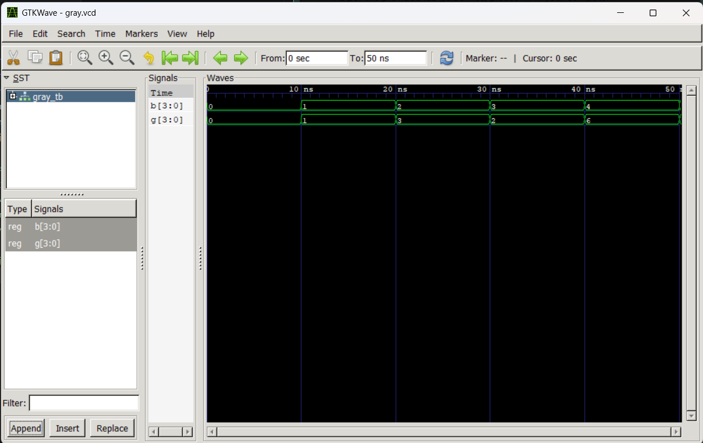

# Computer Architecture Lab 6  
## Binary-to-Gray and BCD-to-Excess-3 Code Converters in VHDL
---

# Objective

- Understand code conversion logic for binary and BCD encodings
- Implement a 4-bit Binary-to-Gray code converter in VHDL
- Implement a 4-bit BCD-to-Excess-3 code converter in VHDL
- Write testbenches to simulate and verify both designs
- Analyze waveform outputs using GTKWave

---

# Tools and Environment

| Tool | Purpose |
|---|---|
| VS Code | Code editor / IDE |
| GHDL | VHDL compiler and simulator |
| GTKWave | Waveform viewer |
| VHDL Extension | Syntax highlighting and snippets |

---

# Theory

## Binary-to-Gray Code Conversion

A Binary-to-Gray converter transforms a binary number into its Gray code equivalent, where only one bit changes between successive values.

- **Input**: 4-bit binary number `B`
- **Output**: 4-bit Gray code number `G`
- **Rule**: `G(3) = B(3)` and `G(i) = B(i+1) xor B(i)` for i = 2 down to 0

### Example
- `B = 0000` → `G = 0000`
- `B = 0001` → `G = 0001`
- `B = 0010` → `G = 0011`

---

## BCD-to-Excess-3 Conversion

A BCD-to-Excess-3 converter adds 3 to a BCD digit to produce the corresponding Excess-3 code.

- **Input**: 4-bit BCD number `BCD` (0–9)
- **Output**: 4-bit Excess-3 number `XS3`
- **Rule**: `XS3 = BCD + 3`

### Example
- `BCD = 0000` → `XS3 = 0011`
- `BCD = 0001` → `XS3 = 0100`
- `BCD = 1001` → `XS3 = 1100`

---

# VHDL Implementation

## Binary-to-Gray Converter (`bin_to_gray.vhd`)

The converter uses bitwise XOR operations to derive the Gray code output from the binary input.

```vhdl
G(3) <= B(3);
G(2) <= B(3) xor B(2);
G(1) <= B(2) xor B(1);
G(0) <= B(1) xor B(0);
```

## BCD-to-Excess-3 Converter (`bcd_to_xs3.vhd`)

The converter uses `unsigned` arithmetic to add 3 to the BCD input.

```vhdl
process(BCD)
begin
    XS3 <= std_logic_vector(unsigned(BCD) + 3);
end process;
```

---

# Simulation Steps

Run the following commands in the terminal from the `lab6` folder:

```bash
# Binary-to-Gray converter
ghdl -a bin_to_gray.vhd gray_tb.vhd
ghdl -e GRAY_TB
ghdl -r GRAY_TB --vcd=gray.vcd

ghdl -a bcd_to_xs3.vhd bcd_xs3_tb.vhd
ghdl -e BCD_XS3_TB
ghdl -r BCD_XS3_TB --vcd=bcd_xs3.vcd
```

Then open the waveform files with GTKWave:

```bash
gtkwave gray.vcd
gtkwave bcd_xs3.vcd
```

---

# Simulation Results

The waveform output shows the converter outputs for a sequence of input values.



---

# Expected Output Analysis

- **Binary-to-Gray converter**: Produces Gray code values where only one output bit changes between consecutive binary inputs.
- **BCD-to-Excess-3 converter**: Correctly adds 3 to each valid BCD input value.
- **Waveform validation**: Both designs can be verified by comparing the output signals in GTKWave against the expected code values.

---

# Files Included

- `bin_to_gray.vhd` - 4-bit Binary-to-Gray converter design
- `gray_tb.vhd` - Testbench for the Binary-to-Gray converter
- `gray.vcd` - Waveform output file for the Gray converter simulation
- `gray_output.png` - Waveform image for the Gray converter output
- `bcd_to_xs3.vhd` - 4-bit BCD-to-Excess-3 converter design
- `bcd_xs3_tb.vhd` - Testbench for the BCD-to-Excess-3 converter
- `bcd_xs3.vcd` - Waveform output file for the Excess-3 converter simulation
- `vcd_output.png` - Additional waveform visualization file
- `readme.md` - This documentation file
